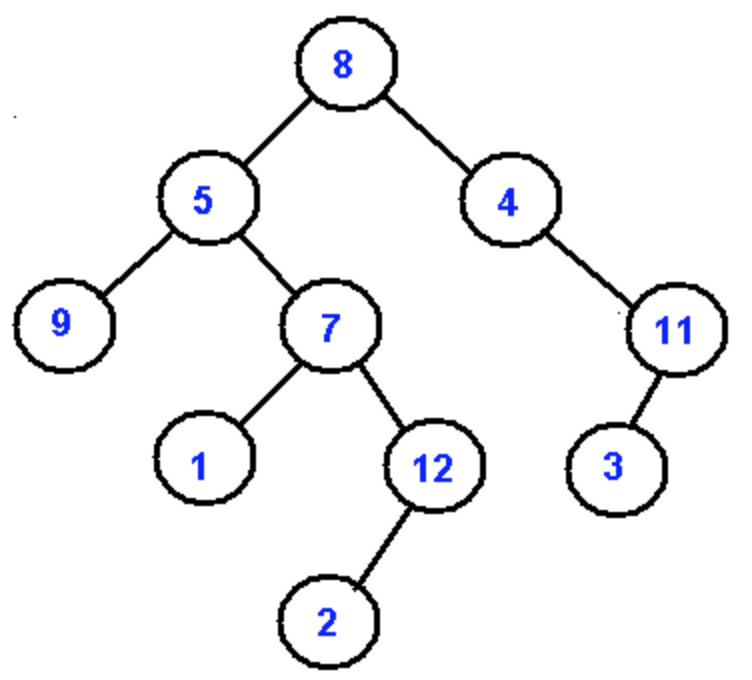
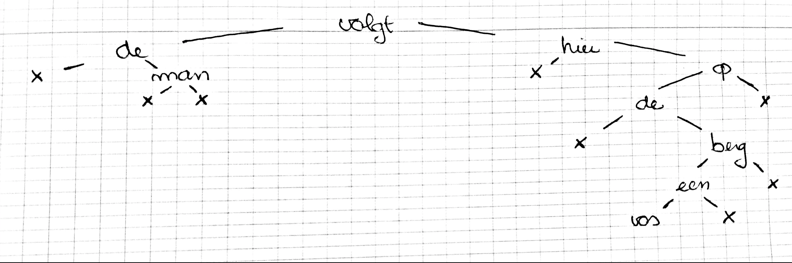

# Labo 4:

We moeten een bestandsformaat bedenken om een binaire boom uit te schrijven
en in te lezen.



## Opdracht 1

Voorstellen in een tekstbestand met per knoop een volgnummer

```txt
1 8
2 5
3 4
4 9
5 7
7 11
10 1
11 12
13 3
19 2
```

De assistent zei dat volgnummers een goed idee zijn maar het probleem nu
is bij het inlezen, we kunnen enkel knopen overlopen die we kennen
dus programma moet veel rekenen om zo'n bestand op te stellen.

> Cnops zegt: fuck den assistent, dat werkt perfect.

## Opdracht 2

We krijgen een boom op volgende manier opgebouwd:

```txt

9 //hoogte

[sleutel] [linkerkindvolgnr] [rechterkindvolgnr]
berg 3 -1
de -1 0
de -1 5
een 7 -1
volgt 2 8
man -1 -1
op 1 -1
vos -1 -1
hier -1 6
```

We zetten er efkes volgnummers bij, dan kan je makkelijk de boom maken

```txt
9
0 berg 3 -1
1 de -1 0
2 de -1 5
3 een 7 -1
4 volgt 2 8
5 man -1 -1
6 op 1 -1
7 vos -1 -1
8 hier -1 6
```

We beginnen met de root. De root heeft geen ouders, dus niemand heeft als
kind de root. Het getal dat nergens voorkomt bij linkerkind en rechterkind
is dus de root. `volgt` is dus de root.

Deze boom zou je moeten bekomen


Als je deze boom nu in preorder om de vraag te bekomen:

```
volgt de man hier op de berg een vos?
```

Als je deze boom in inorder overloopt bekom je het antwoord

```
de man volgt hier de vos een berg op
```
