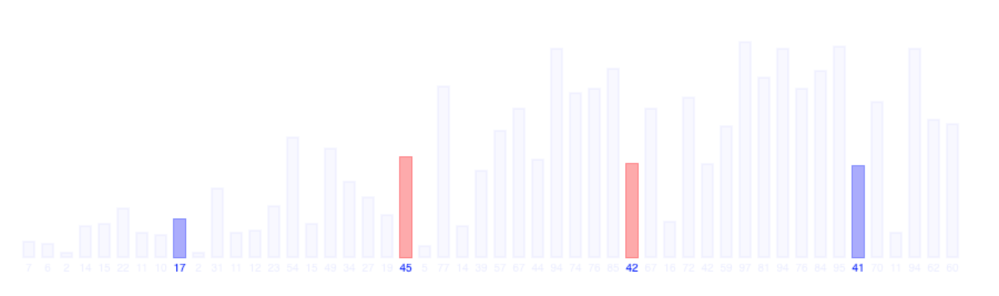

# Test algoritmen

Deze tekst bevat wanneer je bepaalde algoritmes moet gebruiken alsook de code om het algoritme te implementeren. Enjoy.

## Algemene termen:

### stabiel

Een sorteermethode is stabiel als ze voor gelijke waarden de volgorde behoudt die in de oorspronkelijke tabel stond.

### ter plaatse

Een sorteermethode sorteert ter plaatse wanneer ze geen gebruik moet maken van een hulptabel.

### inversie

Een inversie in een tabel zijn paren getallen die in een foute volgorde staan. voorbeeld:

1 10 3 4
==> Het paar 10 en 3 is een inversie
==> Het paar 10 en 4 is ook een inversie

## Sorteeralgoritmen n^2

### insertion sort

Zoals de naam zegt: sorteren met tussenvoegen

#### Wanneer gebruiken?

- voor kleine tabellen
- voor tabellen die nagenoeg geranschikt zijn. Vaak komt insertion sort dus voor bij een laatste stap van efficiëntere methodes

#### Optimalisatie

- Aangezien de deeltabel aan de linkerkant gesorteerd is kunnen we hierin binair zoeken. Zo wordt het zoekproces O(lg(n)) ipv O(n).
  Het resultaat blijft echter kwadratisch

#### Code

```cpp
/*
    2 tellers, i en j
    i  en j moeten altijd buren zijn

    We laten i op 1 beginnen en j eentje daarvoor.
    we houden een hulpwaarde bij zodat we de eerste waarde van v[i] kunnen
   bijhouden

   Wa laten j stapjes terug nemen zolang j groter of gelijk is aan 0 en de
   waarde van h, dus de oorspronkelijke waarde van i kleiner is dan de waarde
   van j op dat moment.

   Waar de teller j stopt wil zeggen dat v[j] kleiner wordt dan de hulpwaarde

   Daarom zetten we de hulpwaarde op plaats j+1
*/

template <class T>
void insertion_sort(vector<T>& v) {
    for (int i = 1; i < v.size(); i++) {
        T h = move(v[i]);  // De te verplaatsen waarde
        int j = i - 1;     // j eentje kleiner laten beginnen dan i
        while (j >= 0 && h < v[j]) {
            // Deze stap verschuift de waarden naar rechts
            v[j + 1] = move(v[j]);
            j--;
        }
        v[j + 1] = move(h);  // Deze stap zet de uiteindelijke waarde juist
    }
}
```

### Shellsort

Bij insertion sort wisselen we 2 elementen naast elkaar van plaats.
Bij shell sort gaan we die plaats groter maken.

Stel, we sorteren de tabel met k plaatsen tussen:


En daarna sorteren we de tabel met j plaatsen tussen, met j < k.


Dan blijft de tabel k gesorteerd.

Shellsort doet exact dit: We beginnen op een bepaalde waarde voor k, bv de vector / 2 en delen dan per stap k / 2, zodat k kleiner wordt.
We noemen dit ook wel shellsort met dalende incrementen.

#### Wanneer gebruiken

- Shellshort gebruikt eigenlijk ook insertion sort. Het is mij dus niet duidelijk in welke situatie
  shellsort beter gebruikt wordt. Ik denk dat het eigenlijk altijd wel 'beter' is dan insertion sort.

#### Optimalisatie:

- We kunnen alle deelrijen voor een bepaalde waarde van k sorteren met insertion sort omdat:
  - als k groot is (bv tabel/2) ==> de deelrij is zeer kort. ==> insertionsort werkt goed bij kleine tabellen
  - als k klein is (bv 2) ==> Een groot deel van de deelrij is al gesorteerd door de vorige stap ==> insertionsort werkt goed zo

#### code:

```c++
/*
    k = de ruimte tussen de elementen die vergeleken worden

    Deze methode is met dalende incrementen, en / 2 per stap. Dit kunnen even
   goed andere stappen zijn
*/
template <class T>
void shell_sort(vector<T>& vector) {
    int k = vector.size() / 2;  // initieel increment

    while (k >= 1) {
        /*
            Dit is het insertion sort deel. In plaats van
            het met adjacente waarden in de array te doen
            doen we dat nu met k plaatsen tussen. Deze
            sorteert dus de deelarray met k plaatsen tussen
        */
        for (int i = k; i < vector.size(); i += k) {  // stappen van k
            T temp = move(vector[i]);
            int j = i - k;  // ipv i - 1 zoals bij insertion, -k

            while (j >= 0 && vector[j] > temp) {
                vector[j + k] = move(vector[j]);
                j -= k;
            }
            vector[j + k] = move(temp);
        }
        k = k / 2;  // Hier verkleinen we k
    }
}
```

### Selection sort

Bij selection sort verdelen we opnieuw de vector in 2 delen: een gesorteerd deel en een ongesorteerd deel.
rechts in de array staat het gesorteerde deel, we beginnen dus aan het maximum.
Van het linkerdeel zoeken we telkens de maximale waarde. Daarna swappen we die maximale waarde
met de laatste plaats van de niet gesorteerde array. Zo gaan we verder

- selection sort sorteert ter plaatse
- niet stabiel

Het probleem zit hem in het maximum bepalen van de deelarray.

#### Wanneer gebruiken?

?

#### Optimalisatie

Als de array voorgesteld wordt als een heap kunnen we het algoritme sneller maken. Zie later (heapsort)

#### code

```c++
/*
    Bij selection sort beginnen we achteraan
    We kijken naar het grootste element, standaard
    zeggen we dat het grootste element zich bevindt op plaats i.
    Als i dan toevallig echt het grootste element is
    zal swap niets doen.

    Het nadeel van deze methode is het maximum bepalen
    Daardoor is de uitvoeringstijd nog altijd O(n^2).
    Door gebruik te maken van een stijgende heap kunnen we
    dit reduceren naar O(nlogn)
*/
template <class T>
void selection_sort(vector<T>& vector) {
    for (int i = vector.size() - 1; i >= 0; i--) {
        // Het maximum zoeken van de array adhv de plaats
        // Dit is de naïeve methode
        int max = i;
        for (int j = 0; j < i; j++) {
            if (vector[j] > vector[max]) {
                max = j;
            }
        }
        swap(vector[i], vector[max]);
    }
}
```

## Efficiente methodes

### Heapsort

Hier gebruiken we een stijgende heap = (stijgende complete binaire boom) om de tabel voor te stellen.
Een eigenschap van een stijgende heap is dat de kop altijd het maximum bevat van de tabel.
Dat lijkt ideaal, al moeten we de tabel dan wel eerst omzetten naar een stijgende heap.

Een stijgende heap moet voldoen aan een heapvoorwaarde: de sleutel bij elke ouder moet tenminste even groot
zijn als de sleutel van zijn kinderen. Kinderen hebben dus altijd kleinere waarden of gelijke waarden als sleutel.

Over heaps hebben we nog niet voldoende gezien volgens mij om te implementeren. We gaan echter een beetje
cheaten. We gaan een methode heapify schrijven die de array omvormt naar een heap. We gaan dat elke stap doen.
Dat lijkt mij niet zo efficiënt maar soit.

### Mergesort

Verdeelt beide tabellen in twee delen en voert daar recursief weer mergesort op uit.

- stabiele methode, ook belangrijk daarom dat je voor kleine tabellen insertion sort gebruikt, want da's stabiel.
- niet ter plaatse

#### Wanneer gebruiken?

- Als we gelinkte lijsten willen sorteren of sequentiële bestanden.
- standaardtechniek voor uitwendig sorteren

#### Optimalisatie?

- Wanneer de tabellen te klein worden kunnen we insertion sort gebruiken om ze te sorteren
- rechtsreeks aan de merge stap beginnen. Je doet de individuele stappen dan niet meer om op te splitsen
  bijgevolg zijn de arrays die je merget nu per se hetzelfde als de eerdere methode
  maar door de merge maakt dat niet uit.

#### code

```c++
/*
    HOE WERKT HET MERGEN?
    we houden 3 tellertjes bij
    k: is er louter om de index te bepalen van de hulparray
    h(ulp)l: gaan we instellen op l zodat we de originele waarde van l nog
   kennen h(ulp)m: gaan we instellen op m zodat we de originele waarde van m nog
   kennen

    We doen zolang 1 van de 2 subarrays doorlopen is:
        - check welk element het kleinste van de eerste 2 niet gekozen elementen
   uit beide subarrays
        - plaats dit element op plaats k in de hulparray.
        - verhoog de juiste tellers, en zeker ook k

    Wanneer 1 van de 2 subarrays doorlopen is kan het zijn dat de andere nog
   niet volledig leeg is. Dus we gaan ze volledig leeg maken met 2 simpele while
   loops

    Daarna doorlopen we de hulparray en plaatsen we de elementen (op de juiste
   plaats) terug in de originele array

*/

template <class T>
void merge(vector<T> &vector, int l, int m, int r, std::vector<T> &hulp) {
    int k = 0;  // k dient om de hulparray in te vullen
    int hl = l;
    int hm = m;
    while (hl < m && hm < r) {
        int kleinste_index = -1;
        if (vector[hm] < vector[hl]) {
            kleinste_index = hm;
            hm++;  // verschuif hm
        } else {
            kleinste_index = hl;
            hl++;  // verschuif hl
        }
        hulp[k] = move(vector[kleinste_index]);
        k++;
    }

    // Ontbrekende zaken toevoegen
    while (hl < m) {
        hulp[k] = move(vector[hl]);
        hl++;
        k++;
    }
    while (hm < r) {
        hulp[k] = move(vector[hm]);
        hm++;
        k++;
    }

    // Hulparray op de juiste plaats in de originele vector steken
    for (int i = 0; i < k; i++) {
        vector[l + i] = move(hulp[i]);
    }
}

/*
    Basically bestaat merge sort uit 4 stappen
    1. Bepaal het midden
    2. Roep recursief merge_sort aan voor de linker deelrij
    3. Roep recursief merge_sort aan voor de rechter deelrij
    4. Merge beide rijen
*/

// ================================================================== //

template <class T>
void merge_sort(vector<T> &vector, int l, int r, std::vector<T> &hulp) {
    // Als de grootte van de array groter is dan 1
    if (r - l > 1) {
        // Veiliger dan (l+r) / 2. Bepaalt het midden,
        // r-l is de grootte van de array
        int m = l + (r - l) / 2;
        merge_sort(vector, l, m, hulp);  // Links deel
        merge_sort(vector, m, r, hulp);  // Rechts deel
        merge(vector, l, m, r, hulp);    // Samenvoegen met hulpvector
    }
}

// ================================================================== //

template <class T>
void merge_sort(vector<T> &vector) {
    std::vector<T> h(vector.size());          // Hulpvector
    merge_sort(vector, 0, vector.size(), h);  // Andere functie aanroepen
}
```

### Quicksort

Het onderverdelen van de partities vraagt hier het meeste werk. je weet niet exact waar je moet partitioneren.
Dat wordt tijdens de methode bepaald. Cnops neemt in zijn voorbeeld de meest linkse sleutel uit de (deel)tabel

- niet stabiel
- ongeveer ter plaatse, de methode gebruikt een stapel
- wanneer 1 recursiestap voltooid is, zit in `hr` de index waar de pivot terecht moet komen.

#### Wanneer gebruiken

?

#### optimalisatie

- pivot niet op een vaste plaats kiezen (met bv mediaan van 3 of random)
- Wanneer er al een aantal recursiestappen doorlopen zijn: de deeltabellen sorteren met insertion sort
- Wanneer er al een aanta recursiestappen doorlopen zijn: de hele tabel sorteren met insertion sort

#### code

```c++
template <typename T>
void quick_sort(vector<T> &vector, int l, int r) {
    if (l < r - 1) {
        T pivot = vector[l];
        int hl = l, hr = r - 1;

        // Dit is om ervoor te zorgen dat we zowel
        // l kunnen kiezen als begin als r

        // Vinden van een waarde kleiner dan de pivot achteraan
        while (vector[hr] > pivot) {
            hr--;
        }

        // Vinden van een waarde groter dan de pivot vooraan
        while (vector[hl] < pivot) {
            hl++;
        }

        // Hier beginnen we effectief te sorteren
        while (hl < hr) {
            swap(vector[hl], vector[hr]);
            hl++;
            hr--;

            // Hier weer hetzelfde doen als ervoor
            while (vector[hl] < pivot) {
                hl++;
            }
            while (vector[hr] > pivot) {
                hr--;
            }
        }

        // Recursief alles sorteren
        quick_sort(vector, l, hr + 1);
        quick_sort(vector, hr + 1, r);
    }
}

// ================================================================== //

template <class T>
void quick_sort(vector<T> &vector) {
    quick_sort(vector, 0, vector.size());
}
```

## Zoeken in niet-gerangschikte tabellen

### Lineair zoeken = O(n)

- gewoon alles overlopen en zoeken naar de juiste waarde.
- sorteren kan zorgen voor sneller zoeken, maar niet als het om 1 element gaat

### Binair zoeken = O(lgn)

Zoeken zoals je zou gokken: Kijk eerst naar de middelste waarde, dan kijken of het groter of kleiner is en dan het midden
nemen van de volgende deeltabel...

```cpp
// Method returns v.size() if element is not in array
// Else method returns place of element
template <class T>
int binairZoeken(vector<T>& v, T& el) {
    int l = 0, r = v.size();  // set l and r
    while (r - l > 1) {  // When size of the vector keeps being bigger than 1
        int m = l + (r - l) / 2;  // Gets the middle of the vector, l is important
        if (el < v[m]) {
            r = m;
        } else {
            l = m;
        }
    }
    return el == v[l] ? l : v.size(); // Let hier op l teruggeven
}
```

#### Toepassingen: cyclisch zoeken

strategie is om twee tellers bij te houden. l = 0 en r = 1. We laten nu r groter worden tot `v[r] > v[l]`.
Dan tellen we naar beneden tot we een waarde uitkomen die terug kleiner wordt dan `v[l]`. Nu hebben we
het beginpunt van de cyclische tabel gevonden.

```c++
template <class T>
int vindCyclischBegin(vector<T>& v) {
    int l = 0, r = 1;

    // We laten r vergroten tot we zien dat r kleiner wordt.
    while (v[l] < v[r]) {
        r *= 2;
    }
    // Daarna tellen we gewoon af tot we de juiste waarde vinden
    // We mogen niet voorbij de vorige waarde van r: r/2
    l = r - 1;
    while (v[l] < v[r] && l >= r / 2) {
        l--;
        r--;
    }

    return r;
}
```

#### Toepassingen: zoeken naar waarde in een reeks van onbekende lengte

Dit kan bv bij een reeks die berekend wordt adhv een functie. We gaan hier ook weer op dezelfde
manier werken als hierboven. we blijven `*2` doen tot we een waarde vinden die groter wordt dan de waarde
die we zoeken. Daarna weten we dat `x/2 <= el <= x`. Op dit interval voeren we binair zoeken uit.

```cpp
int vindInSequentie(int el) {
    int xi = 1;
    while (berekenElementInSequetie(xi - 1) < el) {
        xi *= 2;
    }

    // We weten nu zeker dat xi/2 < el <= xi

    // Nu gaan we binair zoeken in de juiste range van elementen
    return binairZoeken(el, xi / 2, xi);
}
```

### Interpolerend zoeken

= binair zoeken met gewichten, maar dat werkt niet bij mij :'(

### Wanneer deze gebruiken?

- Bij twijfel: binair
- Bij zeer grote tabellen in uitwendig geheugen: interpolerend

## Speciale methodes als je weet dat het over cijfers gaat

### Countingsort

We maken hier een frequentietabel van de getallen in een bepaald interval. Zo kunnen we snel
de plaats bepalen van die getallen.

- sleutels moeten gehele getallen zijn
- getallen zitten in een beperkt interval
- speciaal geval van bucketsort (bij bucketsort hoeven het geen gehele getallen te zijn)
- stabiel
- niet ter plaatse

#### Wanneer gebruiken?

- Bij gehele getallen
- in een beperkt interval

#### code

```cpp
// countingsort werkt alleen met integers
// Het interval is bekend!
// l = linkergrens interval
// r = rechtergrens interval
void countingsort(vector<int>& v, int l, int r) {
    // frequentietabel aanmaken
    vector<int> frequentietabel(r - l + 1, 0);

    for (int i = 0; i < v.size(); i++) {
        // vb: 5 - 5 ==> 5 komt op 0 terecht in de frequentietabel
        frequentietabel[v[i] - l]++;
    }

    // van achter naar voor werken.
    // in i houden we de index bij van de vector die moet gesorteerd worden
    int i = v.size() - 1;

    // het in te vullen getal is r = rechtergrens in het begin
    int getal = r;
    while (i >= 0) {
        // Hier schrijven we het getal het aantal keer uit
        // dat het in de frequentietabel staat
        // let op de -l zodat we zeker op de juiste index zitten
        for (int j = 0; j < frequentietabel[getal - l]; j++) {
            v[i] = getal;
            i--;
        }
        getal--;     // Nu mag het getal verminderen.
    }
}
```

### Radix sort

- werkt op samengestelde sleutels
- elke deelsleutel wordt apart gerangschikt

### Van links naar rechts: binaire quicksort

- We sorteren hier op bits
- Aangezien we hier maar met 2 mogelijke waarden werken, werkt deze methode vrij inituïtief

#### code

```cpp

/*
    Dit is eigenlijk een aangepaste vorm van quicksort.
    Bij quicksort hebben we een pivot nodig. We kiezen
    op voorhand geen pivot bij deze methode.
    . Het enige wat de methode direct overneemt
    is het swap gebeuren om zo veel mogelijk inversies
    op te lossen. De 'pivot' is dan de scheiding
    tussen het laatste element van de linkse array
    en het eerste element van de rechtse array
    Dit werkt omdat er maar twee mogelijke waarden zijn,
    omdat we binair werken. De enige waarden zijn dus 0 en 1
    We gaan eigenlijk gewoon de array bit voor bit gaan goed zetten
    zodat de nullen vooraan komen en de enen achteraan, we verdelen
    de tabel dus in 2 delen, vandaar binair!
    De methode is links naar rechts omdat ze we met het grootste bit beginnen.
    In ons geval staat de grootste bit helemaal links, op plaats 4
    Ik heb het eens gedaan met een array van chars. Om die te kunnen vergelijken
   heb ik dat omgezet naar bits. Ik had het ook gewoon kunnen tonen ints die
   iets binair voorstellen zoals 1010101010 maar da's niet cool, weetwel.

    l = linkergrens
    r = rechtergrens
    b = hoeveelste bit we aan het overlopen zijn
*/

void binaireQuickSort(vector<char>& v, int l, int r, int b) {
    int i = l, j = r - 1;
    // De lengte moet groter blijven dan 1 en de bit mag niet onder 0
    if (r - l > 1 && b >= 0) {
        // Zolang de bit niet geset is links gaan we verder
        while (j != i) {
            while (i < j && !bitIsSet(v[i], b)) {
                i++;
            }
            while (j > i && bitIsSet(v[j], b)) {
                j--;
            }
            swap(v[i], v[j]);
        }
        // Na alle swaps te doen weten we dat i & j elkaar gekruisd zijn
        // Ze zijn gekruisd op dezelfde waarde, namelijk de 'pivot'
        int pivot = i;  // of pivot = j
        b--;            // We verlagen hier de bit naar 1 minder beduidende
        binaireQuickSort(v, l, pivot, b);
        binaireQuickSort(v, pivot, r, b);
    }
}
```

### Van links naar rechts: MSD radix sort

Deze methode is kut. In plaats van binair te werken gaan we werken in een m-tallig stelsel.
In onze vorige methode (binair) werd per bit alles in 2 categoriën verdeeld. Hier verdelen we per bit
of per sleutel alles in m delen. Dat werkt goed, alleen moeten we er dan voor zorgen dat we
elke deelarray die hoort bij dezelfde sleutel apart sorteren.

Dit verdelen in m delen gaan we doen met countsort (licht aangepaste versie). Countsort gaat zichzelf recursief oproepen
voor een lagere exponent. Dat recursief oproepen is nodig voor de verschillende categoriëen. Bij radix = 10 heb
je 10 categorieën om te deelsorteren.

De frequentietabel omzetten naar een hulparray gaat net iets anders dan voorheen. Het is nodig
om de frequentietabel cummulatief te maken en deze omgekeerd te doorlopen. Als we dan een element zijn plaats
willen kennen vragen we dat cijfer op in de frequentietabel entrekken we van de waarde uit de frequentietabel 1 af.

Zie: https://www.cs.usfca.edu/~galles/visualization/RadixSort.html

#### Wanneer?

- Bij sleutels van een variabele lengte

#### Code

```cpp
void radixsort(vector<int>& v, int m) {
    // Maximum aantal getallen in een cijfer
    // normaal moet je dat berekenen, ik heb ervoor gekozen om het hard te
    // coderen
    int max = 3;

    // Help vector
    vector<int> help(v.size(), 0);

    // Pas nu countingsort toe voor een bepaald
    // getal in het cijfer. We beginnen logischerwijs
    // op de grootste exponent, namelijk max.
    countSort(v, max, 10, 0, v.size(), help);
}

// ================================================================== //

// Hier halen we uit een getal bv 5679 een cijfer van een bepaalde index
// met een radix.
// radix is meestal 10, toch hier wel
// dus getNumberAtIndex(5679, 3, 10) = 6
// en getNumberAtIndex(5679, 4, 10) = 5
int getNumberAtIndex(int totaalNummer, int index, int radix) {
    return int(totaalNummer / pow(radix, index - 1)) % radix;
}

// ================================================================== //

/*
    Counting sort toegepast op een bepaalde exponent van 10 in van een getal
    v = de originele vector
    exp = de exponent waarover we praten. bv 3'e exp van 368 wil zeggen: het
    getal 3
    m = de radix, hier het getal 10. We rekenen in een tientallig stelsel
    l = de linkerpositie van de deelrij van v
    r = de rechterpositie van de deelrij van v
    help = een hulpvector van de grootte r - l die dient voor de sortering
    Nadat gesorteerd is binnen de grenzen op de exponent wordt alles terug in v
   geplaatst.
*/

void countSort(vector<int>& v, int exp, int m, int l, int r,
               vector<int>& help) {
    vector<int> frequentietabel(m, 0);

    // Hier maken we de frequentietabel aan
    for (int i = l; i < r; i++) {
        frequentietabel[getNumberAtIndex(v[i], exp, m)]++;
    }

    // Waarden in de frequentietabel cummulatief maken
    for (int i = 1; i < frequentietabel.size(); i++) {
        frequentietabel[i] += frequentietabel[i - 1];
    }

    /* Om de plaats van de elementen te weten te komen in de hulparray
     gebruiken we de frequentietabel. De plaats waar het moet
     terechtkomen is eentje kleiner dan hetgeen in de frequentietabel staat
     voor het getal op die plaats.
     bv: frequentietabel = 1 0 0 0 0 0 0 0 0 0
     Dit wil zeggen: in de vector met bepaalde grenzen komt het getal 0 op een
     bepaalde exp van het getal, 1 keer voor. Zo'n getal kan bv 350 zijn. 0 komt
     voor op de 1e exp
     Als we nu de plaats willen weten van het getal dat daarbij hoort trekken we
     1 af van de waarde van de locatie van frequentietabel[0]
     In de hulptabel staat 0 dus op de 0'de plaats
     Ik verwijs graag naar de link om het algoritme uit te visualiseren voor een
     makkelijkere uitleg
    */

    for (int i = r - 1; i >= l; i--) {
        // Waarde verkleinen in de frequentietabel en dan opvragen
        help[--frequentietabel[getNumberAtIndex(v[i], exp, m)]] = v[i];
    }

    // Waarden terug in de originele vector plaatsen
    for (int i = l; i < r; i++) {
        v[i] = move(help[i - l]);
    }

    exp--;  // Exponent verminderen
    for (int i = 1; i <= frequentietabel.size(); i++) {
        // Enkel nieuwe sorteer doen als de waarden groter zijn dan 1
        if (frequentietabel[i] - frequentietabel[i - 1] > 1 && exp > 0) {
            // Hier wordt een nieuwe hulpvector gemaakt van de juiste grootte
            vector<int> help2(frequentietabel[i] - frequentietabel[i - 1], 0);

            // Doe hier de sortering voor de nieuwe range
            countSort(v, exp, m, frequentietabel[i - 1] + l,
                      frequentietabel[i] + l, help2);
        }
    }
}
```

### Van links naar rechts: ternaire radix quicksort

Dit is eigenlijk gewoon quicksort maar dan met meerdere keys. Omdat hier de pivot maar bestaat
uit 1 cijfer gaan veel cijfers bij de pivot behoren. Op die manier gaat de tabel verdeeld
worden in 3 delen: links elementen die kleiner zijn dan de pivot, in het midden elementen
die gelijk zijn aan de pivot en rechts elementen die groter zijn dan de pivot.

Opnieuw wordt hier recursief gewerkt. Enkel de middelste tabel gaan we sorteren op een volgende sleutel.
De andere deeltabellen gaan we op dezelfde manier als ervoor delen door 3.

De moeilijkheid ligt er ook in de grenzen te bepalen van de middelste deeltabel. Ik heb
hier nog geen efficiënte methode voor gevonden. Deze methode werkt wel

#### Wanneer gebruiken?

- Bij strings is deze methode efficiënter dan MSD radix sort en quicksort

#### code

```cpp
// Hier halen we uit een getal bv 5679 een cijfer van een bepaalde index
// met een radix.
// radix is meestal 10, toch hier wel
// dus getNumberAtIndex(5679, 3, 10) = 6
// en getNumberAtIndex(5679, 4, 10) = 5
int getNumberAtIndex(int totaalNummer, int index, int radix) {
    return int(totaalNummer / pow(radix, index - 1)) % radix;
}

/*
    STAP 1 is meestal je elementen allemaal even groot
    'padden'. Bv v = { 100 10 1210} ==> {0100 0010 1210}
    Maar 'k heb geen zin om met strings te werken dus ik doe
    dat niet
    Deze methode kiest zoals bij quicksort een spilelement. Hier kies ik ook
    de meest linkse. Dan gaan we quicksorten van een bepaald getal van een
   cijfer we gaan bv eerst sorteren op het eerste getal volgens de manier van
   quicksort. Dus links heb je allemaal getallen die kleiner zijn, rechts
   allemaal getallen die groter zijn
    In het midden staat er nu echter meer dan 1 getal, want ja, je sorteert
   slechts op 1 cijfer. Vandaar dat ik die grenzen bepaal met i & j. Wellicht
   kan het sneller, maar deze methode werkt wel
   Daarna werk je recursief op de drie delen
*/
void ternaireRadixQuicksort(vector<int>& v, int exp, int l, int r) {
    if (r - l > 1 && exp > 0) {
        int pivot = getNumberAtIndex(v[l], exp, 10);
        int hl = l, hr = r - 1;

        while (getNumberAtIndex(v[hr], exp, 10) > pivot) {
            hr--;
        }
        while (getNumberAtIndex(v[hl], exp, 10) < pivot) {
            hl++;
        }
        while (hl < hr) {
            swap(v[hl], v[hr]);
            hl++;
            hr--;

            while (getNumberAtIndex(v[hl], exp, 10) < pivot) {
                hl++;
            }
            while (getNumberAtIndex(v[hr], exp, 10) > pivot) {
                hr--;
            }
        }

        // Pivot op de juiste plaats terugzetten, die staat sowieso op v[0]
        // Voorlopig geen betere manier gevonden
        // i is begin van de middenstrook
        // j is het einde van de middenstrook
        int i = l;
        while (getNumberAtIndex(v[i], exp, 10) >
               getNumberAtIndex(v[i + 1], exp, 10)) {
            swap(v[i], v[i + 1]);
            i++;
        }

        int j = i;
        while (getNumberAtIndex(v[j], exp, 10) == pivot) {
            j++;
        }
        // Drie subvectoren opnieuw sorteren
        ternaireRadixQuicksort(v, exp, l, i);
        ternaireRadixQuicksort(v, exp - 1, i, j);
        ternaireRadixQuicksort(v, exp, j, r);
    }
}
```

### van rechts naar links: lsd radix sort

- de meest eenvoudige van de radix sorts
- zelfde methode als MSD ongeveer maar dan omgekeerd
- de methode die de deelsleutels sorteert MOET stabiel zijn
  - countsort is hier goed voor

Er is een eigenschap die zegt dat wanneer je stabiel sorteert op de deelsleutels
en rechts begint je er vanuit mag gaan dat de tabel volledig juist geordend gaat zijn.

#### Wanneer?

- Als het aantal sleutels gekend is
- Bij veelvouden van bytes

#### Optimalisatie

Als er al een aantal sleutels zijn overlopen is de tabel al nagenoeg gesorteerd. Dan is insertion
sort een goed idee.

#### code

```cpp
int getNumberAtIndex(int totaalNummer, int index, int radix) {
    return int(totaalNummer / pow(radix, index)) % radix;
}

void countSort(vector<int>& v, int exp, int m, vector<int>& help) {
    vector<int> frequentietabel(m, 0);

    // Hier maken we de frequentietabel aan
    for (int i = 0; i < v.size(); i++) {
        frequentietabel[getNumberAtIndex(v[i], exp, m)]++;
    }

    // Waarden in de frequentietabel cummulatief maken
    for (int i = 1; i < frequentietabel.size(); i++) {
        frequentietabel[i] += frequentietabel[i - 1];
    }

    // Hulptabel vullen
    for (int i = v.size() - 1; i >= 0; i--) {
        help[--frequentietabel[getNumberAtIndex(v[i], exp, m)]] = v[i];
    }

    v = help;  // Waarden in de gewone tabel steken
}

// m = radix
/*
    Lowest Significant Digit Radix sort werkt zeer eenvoudig.
    We doen eigenlijk hetzelfde als van links naar rechts
    alleen hoeven we hier geen deeltabellen te gebruiken
    zolang dat de sorteermethode die gebruikt wordt voor elk
    deel van het getal stabiel is zal radix sort in zijn totaliteit
    correct werken.
    Voor getallen is countSort een stabiel sorteeralgoritme. Daarom
    kunnen we countSort gebruiken. We hebben hiervoor wel een hulptabel
    nodig en een frequentietabel
    De radix is hier 10
*/
void lsdRadixSort(vector<int>& v, int m, int maxExpo) {
    vector<int> help(v.size(), 0);
    for (int i = 0; i <= maxExpo; i++) {
        countSort(v, i, 10, help);
    }
}
```

### Bucket sort

#### Wanneer

- interval is bekend
- we hoeven niet per se gehele getallen te hebben

bv bij doubles: van `]0.00 - 1.00[`. Als we kijken naar het eerste cijfer na de komma zijn er
10 categorieën. We verdelen de cijfers in al die categoriën. Eigenlijk zijn het dus `vector<vector<double>>`.

Elk van deze aparte vectoren gaan we sorteren met een bepaalde methode. 1 methode is om linked lists
bij te houden en deze gesorteerd te gaan aanvullen. Een andere methode (als het aantal elementen) vrij klein
is, is insertion sort toepassen op elke vector per categorie.

#### code

```cpp
// Geeft het eerste getal na de komma terug
int getFirstDigit(double v) { return int(v * 10); }

// Implementatie met gewone vectoren en wanneer ze gevuld zijn insertion sort
// The good way zou met LinkedLists zijn
// maar daar had ik voorlopig nog geen zin in
void bucketSort(vector<double>& v) {
    vector<vector<double>> buckets(10);

    // Plaats alles in de buckets
    for (int i = 0; i < v.size(); i++) {
        int digit = getFirstDigit(v[i]);
        buckets[digit].push_back(v[i]);
    }

    // Aangezien er maar zeer wenig waarden zijn in de buckets
    // Kunnen we die insertion sorten
    // Met linkedlist zou je ze kunnen toevoegen in gesorteerde
    // volgorde, maar da's voor later
    for (int i = 0; i < buckets.size(); i++) {
        insertion_sort(buckets[i]);
    }

    // .. En dan alles terugplaatsen
    int k = 0;  // k is de index van v
    for (int i = 0; i < buckets.size(); i++) {
        for (int j = 0; j < buckets[i].size(); j++) {
            v[k] = buckets[i][j];
            k++;
        }
    }
}
```
